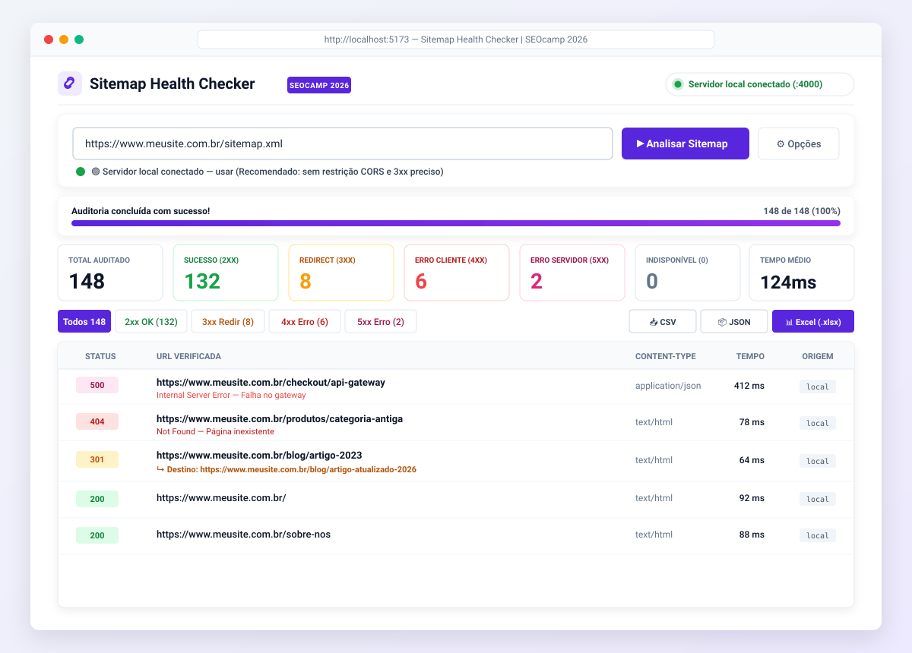
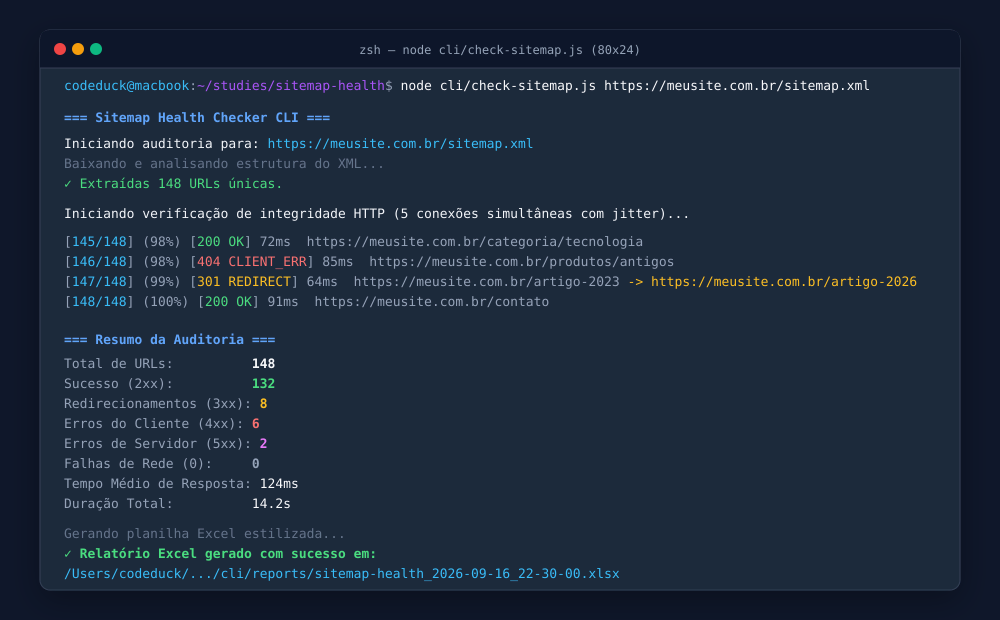
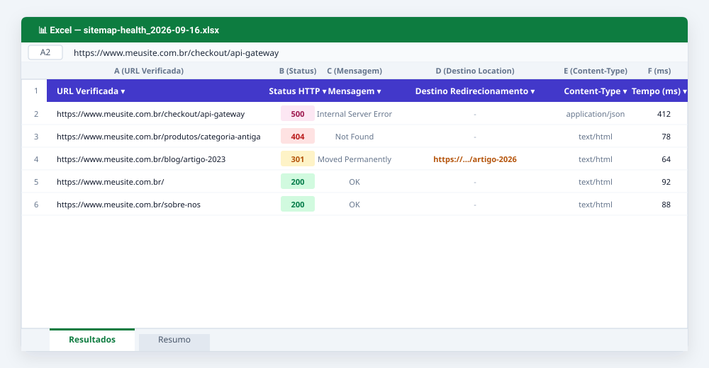

<p align="center">
  <a href="https://www.seocamp.com.br" target="_blank" rel="noopener noreferrer">
    
  </a>
  &nbsp;&nbsp;&nbsp;&nbsp;&nbsp;&nbsp;&nbsp;&nbsp;&nbsp;&nbsp;&nbsp;&nbsp;
  <a href="https://www.seocamp.com.br" target="_blank" rel="noopener noreferrer">
    
  </a>
</p>

<h1 align="center">Sitemap Health Checker</h1>

<p align="center">
  <strong>Auditoria em tempo real de integridade HTTP de sitemaps XML em produção com zero dados simulados.</strong><br />
  Ferramenta desenvolvida especialmente para o evento <a href="https://www.seocamp.com.br" target="_blank"><strong>SEOcamp 2026</strong></a> (<a href="https://www.seocamp.com.br" target="_blank">www.seocamp.com.br</a>).
</p>

<p align="center">
  
  
  
  
  
</p>

---

## 📸 Demonstração Visual da Ferramenta

### 1. Dashboard Web Interativo (React + Vite + CSS Puro)
A interface web permite acompanhar em tempo real o progresso da auditoria com identificação instantânea de anomalias por severidade, filtros rápidos e suporte a download direto:

<p align="center">
  
</p>

---

### 2. Execução Autônoma via Terminal (Motor CLI)
Para rotinas de DevOps, cron jobs ou auditorias ágeis em servidores VPS, o CLI integrado executa checagens concorrentes com feedback colorido no terminal:

<p align="center">
  
</p>

---

### 3. Relatório Excel (.xlsx) com Design Profissional
Ao concluir a análise, uma planilha formatada é gerada automaticamente via `exceljs` com painel congelado, auto-filtro ativado e aba dedicada com sumário executivo:

<p align="center">
  
</p>

---

## ✨ Principais Diferenciais & Engenharia

- 🛡️ **Zero Simulação (Dados 100% Reais):** Nenhum status é inventado. Cada URL reflete respostas de rede reais de produção.
- 🎯 **Captura Precisa de 3xx (Redirects):** Utiliza `maxRedirects: 0` para interceptar a resposta imediata e extrai a URL final absoluta do cabeçalho `Location`.
- ⚡ **Pool Concorrente com Jitter Anti-Block:** Dispara requisições com concorrência controlada (~5 conexões simultâneas) e jitter aleatório de 20ms a 100ms para mitigar bloqueios de WAF / rate limit.
- 🔁 **Resolução Recursiva de Sitemaps:** Identifica automaticamente índices `<sitemapindex>` e varre todos os subsitemaps filhos até extrair o conjunto consolidado e desduplicado de URLs.
- 🌐 **Cascata Inteligente de Fallbacks de CORS:**
  - **Autodetecção do Servidor Local:** Se o Express local responder em `http://localhost:4000/api/health`, a tela ativa automaticamente a integração sem restrições de CORS.
  - **Fallback no Navegador:** Se o servidor local estiver desligado, aplica a cascata: Fetch direto (sitemap) ➔ `corsproxy.io` (lendo `X-Final-URL`) ➔ `allorigins.win`. O fetch direto de URLs fica desativado por padrão para evitar ruído de CORS no console DevTools.
- 📊 **Ordenação por Severidade Crítica:** Erros graves (5xx, 4xx, 0) ➔ Redirecionamentos (3xx) ➔ Páginas Saudáveis (2xx).
- 📑 **Múltiplos Formatos de Exportação:** Download instantâneo de relatórios em **CSV**, **JSON** e **Excel (.xlsx)**.

---

## 🏗️ Arquitetura do Repositório

O projeto é estruturado em um monorepo desacoplado com separação estrita de responsabilidades:

```
sitemap-health-seocamp-new/
├── docs/
│   └── assets/                      # Imagens do README e logotipos oficiais
│       ├── seo_camp_logo.png        # Logo oficial SEOcamp 2026
│       ├── educa_seo_logo.png       # Logo oficial Educa SEO
│       ├── preview-dashboard.svg    # Mockup do Dashboard Web
│       ├── preview-cli.svg          # Mockup da CLI no terminal
│       └── preview-excel.svg        # Mockup da planilha Excel
├── public/
│   └── assets/                      # Assets estáticos servidos pelo Vite
├── src/                             # Frontend React 18 (SPA pura)
│   ├── components/                  # Header, SitemapInput, MetricCards, ResultsTable, etc.
│   ├── services/                    # backendApi, proxyFallback, sitemapParser, concurrencyRunner
│   ├── utils/                       # exportHelpers (ordenação de severidade, CSV, JSON)
│   ├── index.css                    # Variáveis de CSS puro e design tokens obrigatórios
│   ├── App.jsx                      # Orquestrador de estado e fluxo de auditoria
│   └── main.jsx                     # Bootstrap da aplicação React
├── cli/                             # Motor Backend Node isolado ("type": "module")
│   ├── lib/
│   │   ├── httpHeaders.js           # Headers simulando Chrome 120 (macOS, sec-ch-ua, pt-BR)
│   │   ├── sitemap.js               # Extração e parsing recursivo com axios + xml2js
│   │   ├── health.js                # Checagem com maxRedirects: 0 e captura de Location
│   │   ├── concurrency.js           # Gerenciador de fila concorrente com jitter aleatório
│   │   ├── sortResults.js           # Algoritmo de pontuação e ordenação por severidade
│   │   └── excelExport.js           # Geração de arquivo XLSX estilizado com ExcelJS
│   ├── reports/                     # Diretório gerador dos relatórios Excel (.gitkeep)
│   ├── server.js                    # Servidor Express (porta 4000) com saída graciosa em EADDRINUSE
│   ├── check-sitemap.js             # CLI executável com prompt readline e progresso ANSI
│   └── tests/                       # Suíte de testes automatizados TDD (node:test)
├── scripts/
│   └── ensure-cli-deps.cjs          # Script que garante as dependências de cli/node_modules
├── vite.config.js                   # Configuração do Vite com plugin-react
└── package.json                     # Raiz: Vite, Concurrently, scripts de orquestração
```

---

## ✅ Pré-requisitos

### Node.js
Este projeto requer **Node.js v16.0.0 ou superior** para funcionar corretamente.

#### 📥 Como Instalar Node.js

1. **Acesse o site oficial:** [nodejs.org](https://nodejs.org/)

2. **Escolha a versão:**
   - **LTS (Long Term Support)** - Recomendado para produção e projetos estáveis
   - **Current** - Versão mais recente com novos recursos

3. **Instale seguindo o instalador** apropriado para seu sistema operacional (Windows, macOS ou Linux)

#### ✔️ Verificar a Instalação

Após a instalação, abra seu terminal (Prompt de Comando, PowerShell ou Terminal) e execute:

```bash
node --version
npm --version
```

Você deverá ver as versões instaladas. Exemplo:
```
v18.17.1
9.6.7
```

Se as versões aparecerem, Node.js foi instalado com sucesso! ✨

---

## 🚀 Como Executar

### 1. Instalação
Clone o projeto e execute a instalação na raiz:
```bash
npm install
```
> O gatilho `postinstall` executa automaticamente `scripts/ensure-cli-deps.cjs`, garantindo que o diretório `cli/node_modules` seja instalado de forma autônoma e sem fricção.

---

### 2. Rodar o Ambiente Completo (Frontend + Backend)
Para iniciar simultaneamente o servidor Vite (porta 5173) e o motor Express (porta 4000):
```bash
npm run dev
```

Abra seu navegador em: **`http://localhost:5173`**

O dashboard detectará automaticamente o motor local em até 1500ms e habilitará o toggle verde de alta precisão.

---

### 3. Rodar Auditoria Direta pelo Terminal (CLI)
Você pode executar o motor CLI diretamente pelo terminal:

**Com a URL como argumento:**
```bash
node cli/check-sitemap.js https://meusite.com.br/sitemap.xml
```

**Modo interativo (solicita a URL via prompt readline):**
```bash
node cli/check-sitemap.js
```

Ao finalizar, a tabela de resumo será exibida e a planilha Excel será gerada em:
`cli/reports/sitemap-health_<timestamp>.xlsx`

---

## 🧪 Testes Automatizados (TDD)

Todo o motor backend e a integração CLI contam com cobertura de testes automatizados utilizando o runner nativo do Node.js (`node:test` e `node:assert`):

```bash
npm test
```

### Resultados da Suíte de Testes:
```
✔ cli-e2e - executa o script check-sitemap.js contra sitemap real e gera XLSX (458ms)
✔ concurrency - deve processar todos os itens respeitando limite e callback de progresso (115ms)
✔ excelExport - deve gerar planilha com abas Resultados e Resumo formatadas (109ms)
✔ health - deve validar 200, 301 com Location, 404 e status 0 em falha de conexão (33ms)
✔ httpHeaders - deve gerar cabeçalhos contendo Chrome 120 e parâmetros esperados (1ms)
✔ httpHeaders - deve usar fallback quando URL for inválida (0.1ms)
✔ server - rotas da API Express (56ms)
✔ sitemap - deve extrair URLs de sitemapindex recursivo e urlset (29ms)
✔ sortResults - deve pontuar severidade conforme hierarquia exigida (0.6ms)
✔ sortResults - deve ordenar itens colocando erros na frente, depois 3xx, depois 2xx (13ms)

ℹ tests 10 | ℹ pass 10 | ℹ fail 0 | ℹ duration_ms 636ms
```

---

## 🎨 Design Tokens & Variáveis CSS

A identidade visual utiliza CSS puro implementado em `src/index.css`:

```css
:root {
  --color-primary: hsl(250, 84%, 54%);
  --color-secondary: hsl(280, 70%, 60%);
  --color-success: hsl(142, 76%, 36%);
  --color-success-light: hsl(142, 76%, 46%);
  --color-warning: hsl(38, 92%, 50%);
  --color-warning-light: hsl(38, 92%, 60%);
  --color-error: hsl(0, 84%, 60%);
  --color-error-light: hsl(0, 84%, 70%);
  --color-neutral-50: hsl(220, 20%, 97%);
  --color-neutral-100: hsl(220, 18%, 93%);
  --color-neutral-200: hsl(220, 16%, 85%);
  --color-neutral-500: hsl(220, 10%, 40%);
  --color-neutral-600: hsl(220, 12%, 30%);
  --color-neutral-800: hsl(220, 16%, 12%);
  --radius-sm: 0.375rem;
  --radius-md: 0.5rem;
  --radius-lg: 0.75rem;
  --shadow-md: 0 4px 6px -1px rgba(0,0,0,.1), 0 2px 4px -1px rgba(0,0,0,.06);
  --spacing-xs: .25rem;
  --spacing-sm: .5rem;
  --spacing-md: 1rem;
  --spacing-lg: 1.5rem;
  --spacing-xl: 2rem;
}
```

---

## 🤝 Evento & Comunidade

Projeto desenvolvido para a comunidade de SEO e desenvolvimento web:
- **Evento:** [SEOcamp 2026](https://www.seocamp.com.br)
- **Portal Oficial:** [www.seocamp.com.br](https://www.seocamp.com.br)
- **Apoio:** Educa SEO

---

## 📄 Licença
Distribuído sob a licença MIT. Consulte o arquivo de licença para mais detalhes.
